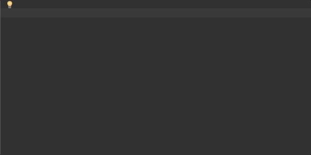

# Laravel Blade Live Templates
PhpStorm Live templates let you insert frequently-used or custom code constructs into your source code file quickly, efficiently, and accurately.

This repo contains live templates for frequently-used Laravel Blade directives.

## How to install
1) Download the *Laravel-Blade.xml* file.
2) Find out where is your JetBrains Application Configuration directory:
* Read this documentation: [Directories used by the IDE::Configuration directory](https://www.jetbrains.com/help/phpstorm/directories-used-by-the-ide-to-store-settings-caches-plugins-and-logs.html#config-directory)
3) Put *Laravel-Blade.xml* file into *templates* folder.
4) Restart PhpStorm.

5) To see all templates, go to *Preferences->Live Templates* and expand *Laravel-Blade*.

## Templates
* **@elseif** : Blade @elseif
* **@for** : Blade @for
* **@foreach** : Blade @foreach
* **@if** : Blade @if
* **@ifelse** : Blade @ifelse
* **@include** : Blade @include
* **@layout** : Blade template skeleton
* **@section** : Blade @section
* **@while** : Blade @while
* **{{** : Blade {{ echo data }}
* **@yield** : Blade @yield
* **@extends** : Blade @extends
* **@sectionx** : Blade @section extended
* **{{{** : Blade {{{ echo escaped data }}}
* **@unless** : Blade @unless
* **{{--** : Blade comments
* **@forelse** : Blade @forelse
* **{!!** : Blade {!! echo raw data !!}
* **@component** : Blade @component
* **component** : Blade component scaffold
* **@auth** : Blade @auth
* **@guest** : Blade @guest
* **@switch** : Blade @switch
* **@includeWhen** : Blade @includeWhen
* **@each** : Blade @each
* **@push** : Blade @push
* **@stack** : Blade @stack
* **@inject** : Blade @inject
* **@can** : Blade @can
* **@cannot** : Blade @cannot
* **@verbatim** : Blade @verbatim
* **@isset** : Blade @isset
* **@empty** : Blade @empty
* **mix** : Laravel's global mix function
* **@lang** : Blade @lang
* **@slot** : Blade @slot
* **@json** : Blade @json
* **@hasSection** : Blade @hasSection
* **@csrf** : Blade CSRF Field
* **@method** : Blade @method
* **@includeIf** : Blade @includeIf
* **@includeFirst** : Blade @includeFirst
* **@prepend** : Blade @prepend
* **@doc** : Blade @php /** PHPDoc */

## Contributing
1. Fork it
2. Create your feature branch (git checkout -b my-new-directive)
3. Replace the *Laravel-Blade.xml* with your current config file from PhpStorm templates folder.
4. Update this *README.md* file. 
5. Commit your changes (git commit -m 'Add new blade directive')
6. Push to the branch (git push origin my-new-directive)
7. Create new Pull Request

## License
The MIT License (MIT). Please see License File for more information.    
